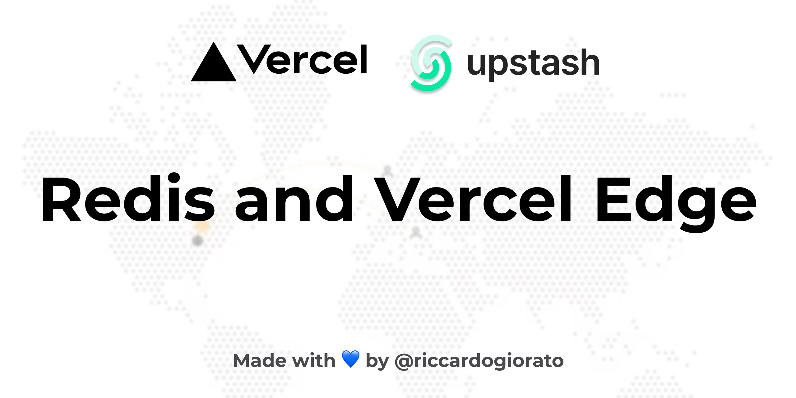

# Redis with Vercel Edge



## No Extra packages added, super light version!

This is a [Next.js](https://nextjs.org/) and with [Upstash Redis](https://upstash.com/)

## Getting Started

First, run the development server:

```bash
npm run dev
# or
yarn dev
```

Open [http://localhost:3000](http://localhost:3000) with your browser to see the result.

You can start editing the page by modifying `src/pages/index.js`. The page auto-updates as you edit the file.

## Remember to add your Upstash Secrets

Register on [Upstash](https://upstash.com/) and add your secrets to the `.env` file, the following ones:

    ```bash
    UPSTASH_REDIS_REST_URL=
    UPSTASH_REDIS_REST_TOKEN=
    ```
